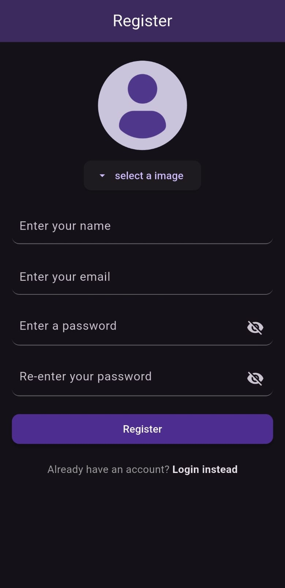
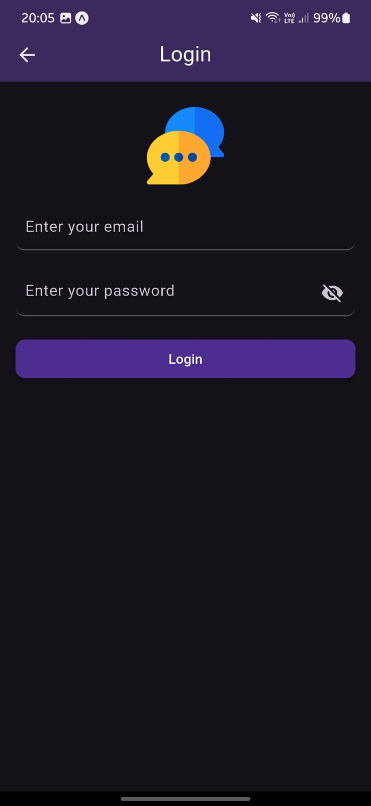
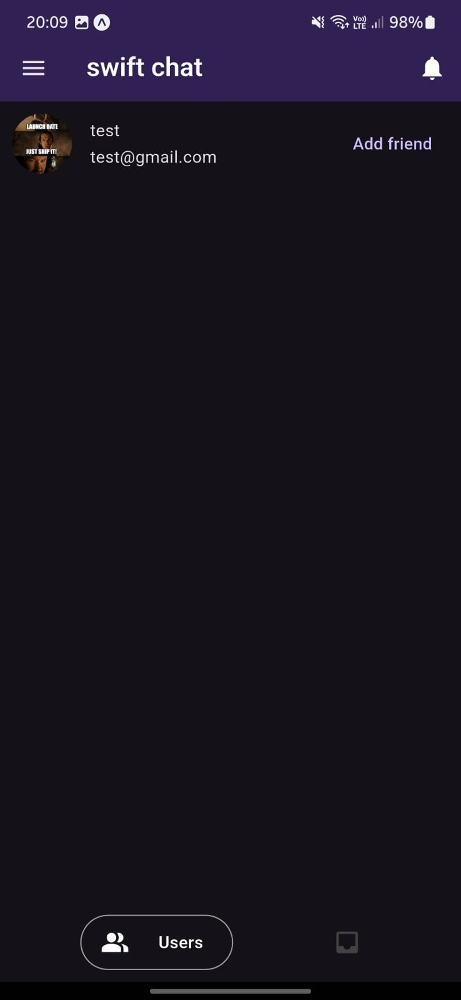

# 💬 Flutter + Express Real-Time Chat App

A sleek and modern **one-on-one real-time chat application** built using **Flutter** (frontend) and **Express.js** (backend with Socket.IO). Users can sign up, log in, connect with friends, send and receive friend requests, and chat instantly with a beautiful and smooth UI. ✨

---

## ✨ Features

- ✅ User Authentication (Sign Up & Login)
- 📷 Profile Image Upload on Sign Up
- 📜 Email + Name + Password Based Sign Up
- 🔐 Secure Email & Password Login
- 👥 View All Users & All Friends
- 📩 Send & Receive Friend Requests
- 🔔 Notification Panel for Friend Requests
- 🢑 Real-time One-on-One Chat using Socket.IO
- 🎯 Stream-based chat updates using StreamController
- 📅 Smart UI that shows "Start Conversation" when there are no chats
- 📱 Keyboard-aware smooth scrolling to latest messages
- 📤 Send Messages with Beautiful Input Box
- 🛍️ Bottom Navigation Bar + Drawer Integration
- ⟳ Persistent Socket Connection Per Screen

---

## 📸 Screenshots

> *Add your own screenshots here to showcase the UI*

| Sign Up Screen | Login Screen | All Users |
| -------------- | ------------ | --------- |
|  |  |  |

| All Friends | Notifications | Chat Screen |
| ----------- | ------------- | ----------- |
|  |  |  |

---

## 📁 Project Structure

### Flutter (Frontend)

```
lib/
├── auth/
│   └── screens/ (SignUp, Login)
├── chat/
│   ├── pages/ (ChatScreen)
│   └── widgets/ (ChatTile)
├── core/
│   ├── socket/ (Socket Logic)
│   └── widgets/ (Common Widgets like Loader)
├── models/
│   └── user_model.dart (UserModel)
├── services/
│   ├── chat/ (ChatService)
│   └── user/ (UserService)
└── main.dart
```

### Express.js (Backend)

```
backend/
├── controllers/
├── models/
├── routes/
└── index.js
```

---

## ⚙️ Tech Stack

### 💻 Frontend (Flutter)

- `flutter_bloc` for state management
- `flutter_keyboard_visibility` to detect keyboard changes
- `StreamController` for UI-based chat stream control
- `socket_io_client` for real-time messaging
- Custom `BottomNavigationBar` & `Drawer`

### 🌐 Backend (Express.js)

- `Express.js` REST APIs
- `Socket.IO` for WebSocket-based real-time communication
- `Multer` or similar for profile image uploads
- `JWT` for authentication

---

## 🧪 How It Works

### Sign Up Flow

- Enter `email`, `name`, `password`, and (optionally) upload a profile image
- Data is sent to backend and stored securely

### Login Flow

- User logs in with `email` and `password`
- Receives a JWT token for authenticated requests

### Home Screen

- **Bottom Navigation contains**:
- **All Friends** → Your connected friends
- **All Users** → All app users, with ability to send requests
- **Top-right:** Notification icon opens friend requests

### Chat Flow

- Click on a friend to open **Chat Screen**
- Chat screen connects to backend via **Socket.IO**
- All messages update in real-time
- Auto-scroll to latest message on:
  - New message arrival
  - Keyboard appearance
- Empty conversation? You'll see `Start Conversation` hint in center

---

## 🛠️ How to Run

### 💻 Backend (Node + Express)

```bash
cd backend
npm install
node server.js
# or use nodemon
```

### 📱 Flutter App

```bash
flutter pub get
flutter run
```

---

## 📌 To-Do / Future Enhancements

-

---

## 💖 Credits

Made with ❤️ using Flutter & Express.\
Special thanks to all contributors and open-source packages used in this project.

---

## 📄 License

This project is open-sourced under the MIT License.

